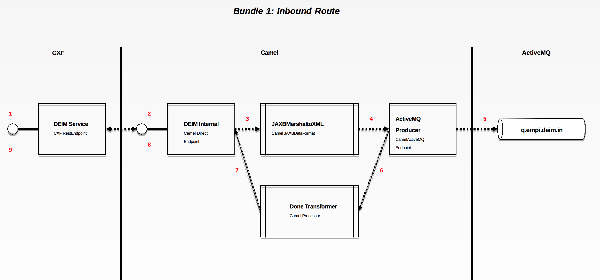
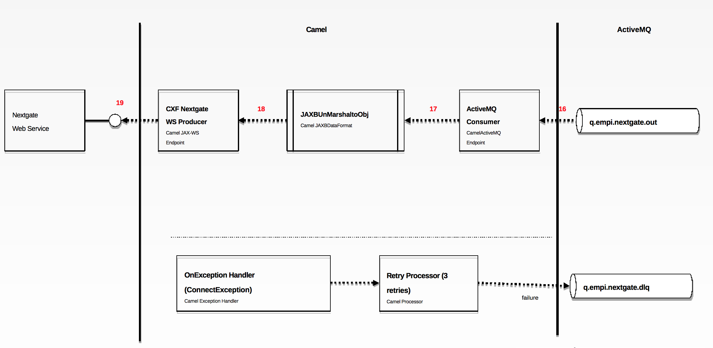

# Business Scenario 
This project facilitates synchronization of master patient records across different healthcare providers. It is important to have consistent patient information across these multiple providers so that patients may receive consistent care. For that to occur, their personal and medical information needs to be shared. Also, any updates to the patient record need to flow across the providers to maintain accuracy and currency.

It is assumed you already have Java 1.8 and Maven 3+ installed.

## Architecture
4 microservices compose this application. 
* inbound - accept the patient record via rest api and store it in a message queue
* xlate - proceed the record and covert it to adapted object, therefore store it in another message queue 
* outbound - proceed the records from the queue and send it to nextgate webservice
* nextgatemock - similator the  webservice service, nextgatemock is only test purpose for mocking the nextgate webservice provider, it don't do anything in real scenaio

Each microservice can be run seperatedly as following.

To see how to run, click :

## inbound microservice
It runs a REST server and sends the message to a message broker.
Rest service is provided by camel-rest component conviniently.

[embedmd]:# (core/inbound/src/main/resources/spring/camel-context.xml)

    <restConfiguration bindingMode="off" component="servlet" contextPath="/rest" />
    <rest id="rest-e0cd6e73-45e0-4834-a5d3-17070409a066" apiDocs="true" path="/service">
      <post id="83790b76-0372-420b-974f-125b31cb82bf" uri="/demos">
        <to uri= "direct:inbox" />
      </post>
    </rest>

Then Using camel route to proceed the request and heading to message queue:

    <route id="handleRest">
      <from id="_from1" uri="direct:inbox" />
      <log id="_log1" message="Xml received" />
      <to id="_to1" uri="direct:deim_internal" />
    </route>
    <route id="addPerson">
      <from id="_from2" uri="direct:deim_internal" />
      <unmarshal ref="personDataFormat" id="_unmarshal1" />
      <log id="_log2" message="Start to set customerId headers=${body.getLocalid}" />
      <setHeader headerName="customerId" id="_setHeader1">
        <simple>${body.getLocalid}</simple>
      </setHeader>
      <log id="_log3" message="Marshalling object to xml" />
      <marshal ref="personDataFormat" id="_mashal1" />
      <log id="_log4" message="Add to amq queue" />
      <setExchangePattern id="_setExchangePattern1" pattern="InOnly"/>
      <to id="_to2" uri="amqp:queue:q.empi.deim.in" />
      <log id="_log5" message="Set body" />
      <setBody id="_setBody1">
        <simple><![CDATA[<reply id="${header.customerId}">Done!</reply>]]></simple>
      </setBody>
    </route>

## xlate
It translates the message from the Person format to the NextGate accepted object format, therefore store in message queue

The route code: 

    <bean id="serviceStrategy"
        class="org.apache.camel.dataformat.soap.name.ServiceInterfaceStrategy">
        <constructor-arg value="com.sun.mdm.index.webservice.PersonEJB" />
        <constructor-arg value="true" />
    </bean>

    <camelContext id="xlatePerson" xmlns="http://camel.apache.org/schema/spring" trace="false" typeConverterStatisticsEnabled="true">

        <dataFormats>
        <soapjaxb contextPath="com.sun.mdm.index.webservice" id="nextgateFormat" elementNameStrategyRef="serviceStrategy" />
        <jaxb id="personFormat" contextPath="com.customer.app" partClass="com.customer.app.Person" />
        </dataFormats>

        <route id="translate">
        <from id="_from1" uri="amqp:queue:q.empi.deim.in" />
                
                <log id="_log1" message="Message received converting to String >>>" />
                
                <convertBodyTo type="String" />
                
                <log id="_log2" message="Unmarshalling >>>${body}" />
                
                <unmarshal id="_unmarshal1" ref="personFormat" />
                
                <log id="_log3" message="Converting obj to ExecuteMatchUpdate >>>${body}" />
                
                <convertBodyTo id="_convertBodyTo1" type="com.sun.mdm.index.webservice.ExecuteMatchUpdate" />
                
                <log id="_log4" message="Marshalling >>>${body}" />
                
                <marshal ref="nextgateFormat" />
                
                <log id="_log5" message="Sending to nextgate queue>>>${body}" />

                <setExchangePattern id="_setExchangePattern1" pattern="InOnly"/>
                <to id="_to1" uri="amqp:q.empi.nextgate.out" />
                
                <onException id="_onException1">
                    <exception>org.apache.camel.TypeConversionException</exception>
                    
                    <redeliveryPolicy maximumRedeliveries="3"/>
            <log id="_log6" message=">>Exception:${body}" />
                <setExchangePattern id="_setExchangePattern2" pattern="InOnly"/>	
                    <to id="_to2" uri="amqp:q.empi.transform.dlq" />
                </onException>

        </route>

    </camelContext>

## Outbound microservice
It reads the final message from the broker and sends it to the NextGate sever

The outbound route code:

    <bean id="serviceStrategy"
            class="org.apache.camel.dataformat.soap.name.ServiceInterfaceStrategy">
            <constructor-arg value="com.sun.mdm.index.webservice.PersonEJB" />
            <constructor-arg value="true" />
        </bean>

        <cxf:cxfEndpoint id="personEndpoint"
            address="http://0.0.0.0:9090/ws/nextgate"
            serviceClass="com.redhat.usecase.service.NextgateWS" wsdlURL="classpath:wsdl/nextgateService.wsdl" >
            <cxf:properties>
                <entry key="dataFormat" value="MESSAGE" />
            </cxf:properties>
        </cxf:cxfEndpoint>
    <camelContext xmlns="http://camel.apache.org/schema/spring" id="outboundSOAP" >
        <dataFormats>
        <soapjaxb contextPath="com.sun.mdm.index.webservice" id="nextgateFormat" elementNameStrategyRef="serviceStrategy" />    
        </dataFormats>
        <route id="_OutBoundRoute1">
        <from id="_from1" uri="amqp:q.empi.nextgate.out" />

                <log id="_log1" message="Message received converting >>>"  />
                <convertBodyTo id="_convertBodyTo1" type="String" />
                
                <unmarshal ref="nextgateFormat" />

                <log id="_log2" message="Calling Webservice >>> ${body}" />

                <to id="_to1" uri="cxf:bean:personEndpoint" />

                <log id="_log2" message="Webservice called >>>"  />

                <onException id="_onException1">
                    <exception>java.net.ConnectException</exception>

                    <redeliveryPolicy maximumRedeliveries="3" />

            <setExchangePattern id="_setExchangePattern1" pattern="InOnly"/>
                    <to id="_to2" uri="amqp:q.empi.nextgate.dlq" />
                </onException>
            </route>

    </camelContext>

## How to Run
Video instruction, Please click:

### 1) Start AMQ7 or Artemis

Make sure that the following queue are created in the etc/broker.xml

         <address name="q.empi.deim.in">
            <anycast>
               <queue name="q.empi.deim.in" />
            </anycast>
         </address>
         <address name="q.empi.nextgate.out">
            <anycast>
               <queue name="q.empi.nextgate.out" />
            </anycast>
         </address>
         <address name="q.empi.nextgate.dlq">
            <anycast>
               <queue name="q.empi.nextgate.dlq" />
            </anycast>
         </address>
         <address name="q.empi.transform.dlq">
            <anycast>
               <queue name="q.empi.transform.dlq" />
            </anycast>
         </address>

Make sure that amqp protocol and 5276 port is up.

 <!-- AMQP Acceptor.  Listens on default AMQP port for AMQP traffic.-->
         <acceptor name="amqp">tcp://0.0.0.0:5672?tcpSendBufferSize=1048576;tcpReceiveBufferSize=1048576;protocols=AMQP;useEpoll=true;amqpCredits=1000;amqpLowCredits=300</acceptor>

Start AMQ7

    ./artemis-service run
    Starting artemis-service
    artemis-service is now running (29960)

Check

    /lab/amq/brokers/amq7/bin >>>sudo netstat -tupln|grep 5672
    tcp6       0      0 :::5672                 :::*                    LISTEN      15629/java

### 2) Run the inbound service
    
        mvn spring-boot:run

In a new terminal, test a rest post method with curl command:
        
    curl -k http://127.0.0.1:8080/rest/service/demos -X POST  -H "Content-Type: text/xml" --data-binary "@/workspace/ai_advanced_labs/experienced-integration-labs/code/06_homework-assignment/core/inbound/src/test/data/PatientDemographics.xml" 
    
It should return if no error return:

    <reply id="p:localid">Done!</reply>

In the inbound service terminal:

    07:53:43.716 [main] INFO  o.a.c.m.ManagedManagementStrategy - JMX is enabled
    07:53:43.953 [main] INFO  o.a.camel.spring.SpringCamelContext - StreamCaching is not in use. If using streams then its recommended to enable stream caching. See more details at http://camel.apache.org/stream-caching.html
    07:53:44.140 [main] INFO  o.a.camel.spring.SpringCamelContext - Route: handleRest started and consuming from: direct://inbox
    07:53:44.141 [main] INFO  o.a.camel.spring.SpringCamelContext - Route: addPerson started and consuming from: direct://deim_internal
    07:53:44.143 [main] INFO  o.a.camel.spring.SpringCamelContext - Route: 83790b76-0372-420b-974f-125b31cb82bf started and consuming from: servlet:/service/demos?httpMethodRestrict=POST
    07:53:44.143 [main] INFO  o.a.camel.spring.SpringCamelContext - Total 3 routes, of which 3 are started
    07:53:44.143 [main] INFO  o.a.camel.spring.SpringCamelContext - Apache Camel 2.21.0.fuse-720050-redhat-00001 (CamelContext: MyCamel) started in 0.428 seconds
    07:53:44.180 [main] INFO  o.s.b.c.e.u.UndertowEmbeddedServletContainer - Undertow started on port(s) 8081 (http)
    07:53:44.184 [main] INFO  o.s.c.s.DefaultLifecycleProcessor - Starting beans in phase 0
    07:53:44.191 [main] INFO  o.s.b.a.e.jmx.EndpointMBeanExporter - Located managed bean 'healthEndpoint': registering with JMX server as MBean [org.springframework.boot:type=Endpoint,name=healthEndpoint]
    07:53:44.234 [main] INFO  o.s.b.c.e.u.UndertowEmbeddedServletContainer - Undertow started on port(s) 8080 (http)
    07:53:44.237 [main] INFO  c.r.usecase.springboot.Application - Started Application in 5.705 seconds (JVM running for 12.462)
    07:54:06.283 [XNIO-3 task-1] INFO  o.a.c.c.s.CamelHttpTransportServlet - Initialized CamelHttpTransportServlet[name=CamelServlet, contextPath=]
    07:54:06.325 [XNIO-3 task-1] INFO  handleRest - Xml received
    07:54:06.334 [XNIO-3 task-1] INFO  o.a.c.converter.jaxp.StaxConverter - Created XMLInputFactory: com.sun.xml.internal.stream.XMLInputFactoryImpl@394197e0. DOMSource/DOMResult may have issues with com.sun.xml.internal.stream.XMLInputFactoryImpl@394197e0. We suggest using Woodstox.
    07:54:06.435 [XNIO-3 task-1] INFO  addPerson - Start to set customerId headers=p:localid
    07:54:06.436 [XNIO-3 task-1] INFO  addPerson - Marshalling object to xml
    07:54:06.451 [XNIO-3 task-1] INFO  addPerson - Add to amq queue
    07:54:06.785 [AmqpProvider :(1):[amqp://localhost:5672]] INFO  o.a.q.jms.sasl.SaslMechanismFinder - Best match for SASL auth was: SASL-PLAIN
    07:54:06.829 [AmqpProvider :(1):[amqp://localhost:5672]] INFO  org.apache.qpid.jms.JmsConnection - Connection ID:2904d1a3-92f1-4b71-9bf1-8b5503dec2d4:1 connected to remote Broker: amqp://localhost:5672
    07:54:06.956 [XNIO-3 task-1] INFO  addPerson - Set body

As you can see, the xml has been proceeded by rest and return the Done acknowledge.

### 3) Run the xlate service (In a seperate terminal)
    
    mvn spring-boot:run
    
    08:46:08.194 [AmqpProvider :(1):[amqp://localhost:5672]] INFO  o.a.q.jms.sasl.SaslMechanismFinder - Best match for SASL auth was: SASL-PLAIN
    08:46:08.257 [AmqpProvider :(1):[amqp://localhost:5672]] INFO  org.apache.qpid.jms.JmsConnection - Connection ID:92f6261b-5c62-429b-99dc-694d46d19046:1 connected to remote Broker: amqp://localhost:5672
    08:46:08.257 [main] INFO  o.a.camel.spring.SpringCamelContext - Route: translate started and consuming from: amqp://queue:q.empi.deim.in
    08:46:08.258 [main] INFO  o.a.camel.spring.SpringCamelContext - Total 1 routes, of which 1 are started
    08:46:08.258 [main] INFO  o.a.camel.spring.SpringCamelContext - Apache Camel 2.21.0.fuse-720050-redhat-00001 (CamelContext: MyCamel) started in 1.501 seconds
    08:46:08.326 [main] INFO  o.s.b.c.e.u.UndertowEmbeddedServletContainer - Undertow started on port(s) 8181 (http)
    08:46:08.330 [main] INFO  o.s.c.s.DefaultLifecycleProcessor - Starting beans in phase 0
    08:46:08.341 [main] INFO  o.s.b.a.e.jmx.EndpointMBeanExporter - Located managed bean 'healthEndpoint': registering with JMX server as MBean [org.springframework.boot:type=Endpoint,name=healthEndpoint]
    08:46:08.386 [main] INFO  o.s.b.c.e.u.UndertowEmbeddedServletContainer - Undertow started on port(s) 8180 (http)
    08:46:08.391 [main] INFO  c.r.customer.springboot.Application - Started Application in 6.794 seconds (JVM running for 9.975)
    08:46:08.444 [Camel (MyCamel) thread #1 - JmsConsumer[q.empi.deim.in]] INFO  translate - Message received converting to String >>>
    08:46:08.446 [Camel (MyCamel) thread #1 - JmsConsumer[q.empi.deim.in]] INFO  translate - Unmarshalling >>>
    08:46:08.453 [Camel (MyCamel) thread #1 - JmsConsumer[q.empi.deim.in]] INFO  o.a.c.converter.jaxp.StaxConverter - Created XMLInputFactory: com.sun.xml.internal.stream.XMLInputFactoryImpl@25e18d07. DOMSource/DOMResult may have issues with com.sun.xml.internal.stream.XMLInputFactoryImpl@25e18d07. We suggest using Woodstox.
    08:46:08.476 [Camel (MyCamel) thread #1 - JmsConsumer[q.empi.deim.in]] INFO  translate - Converting obj to ExecuteMatchUpdate >>>
    08:46:08.478 [Camel (MyCamel) thread #1 - JmsConsumer[q.empi.deim.in]] INFO  translate - Marshalling >>>
    08:46:08.497 [Camel (MyCamel) thread #1 - JmsConsumer[q.empi.deim.in]] INFO  translate - Sending to nextgate queue>>>
    08:46:08.549 [Camel (MyCamel) thread #1 - JmsConsumer[q.empi.deim.in]] INFO  translate - Message received converting to String >>>
    08:46:08.549 [Camel (MyCamel) thread #1 - JmsConsumer[q.empi.deim.in]] INFO  translate - Unmarshalling >>>
    08:46:08.558 [Camel (MyCamel) thread #1 - JmsConsumer[q.empi.deim.in]] INFO  translate - Converting obj to ExecuteMatchUpdate >>>
    08:46:08.558 [Camel (MyCamel) thread #1 - JmsConsumer[q.empi.deim.in]] INFO  translate - Marshalling >>>
    08:46:08.559 [Camel (MyCamel) thread #1 - JmsConsumer[q.empi.deim.in]] INFO  translate - Sending to nextgate queue>>>
    08:49:53.213 [Camel (MyCamel) thread #1 - JmsConsumer[q.empi.deim.in]] INFO  translate - Message received converting to String >>>
    08:49:53.213 [Camel (MyCamel) thread #1 - JmsConsumer[q.empi.deim.in]] INFO  translate - Unmarshalling >>>
    08:49:53.218 [Camel (MyCamel) thread #1 - JmsConsumer[q.empi.deim.in]] INFO  translate - Converting obj to ExecuteMatchUpdate >>>
    08:49:53.218 [Camel (MyCamel) thread #1 - JmsConsumer[q.empi.deim.in]] INFO  translate - Marshalling >>>
    08:49:53.219 [Camel (MyCamel) thread #1 - JmsConsumer[q.empi.deim.in]] INFO  translate - Sending to nextgate queue>>>

As you can see, the message in the deim.in queue has been proceeded and output to another queue nextgate.out

### 4) Run the outbound service (In a seperate terminal)
    mvn spring-boot:run

### 5) Start the mock nextgate webservice 
    cd nextgate
    mvn camel:run

### 5) Final Test (In a seperate terminal):
    curl -k http://127.0.0.1:8080/rest/service/demos -X POST  -H "Content-Type: text/xml" --data-binary "@/workspace/ai_advanced_labs/experienced-integration-labs/code/06_homework-assignment/core/inbound/src/test/data/PatientDemographics.xml"

### 6) It should return the result if there is no error happen:
    12:00:53.842 [Camel (MyCamel) thread #1 - JmsConsumer[q.empi.nextgate.out]] INFO  _OutBoundRoute1 - Calling Webservice >>> <?xml version="1.0" encoding="UTF-8" standalone="yes"?>
    <ns2:executeMatchUpdate xmlns:ns2="http://webservice.index.mdm.sun.com/">
        <callerInfo>
            <application>App</application>
            <applicationFunction>Function</applicationFunction>
            <authUser>Xlate</authUser>
        </callerInfo>
        <sysObjBean>
            <person>
                <fatherName>p:fathername</fatherName>
                <firstName>p:given</firstName>
                <gender>p:code</gender>
            </person>
        </sysObjBean>
    </ns2:executeMatchUpdate>

    12:00:54.405 [default-workqueue-1] INFO  _OutBoundRoute1 - Webservice called >>>

